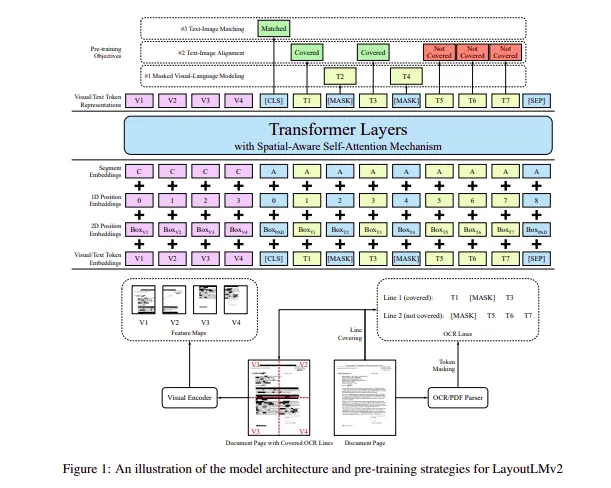
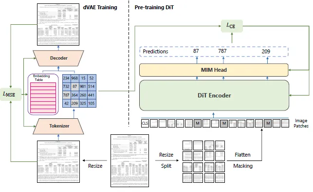

# LLM_DocClassify
## The Models

### LayoutLMv2

- Combination of convolutional and transformer-based architectures. Transformers are used to understand the sequential nature of the text and conv layers are used to extract the pixel features from the document's layout. For pixel embedding, The input image is resized to 224x224 and then fed into the visual backbone. On the other hand, the layout embedding extracts the spatial information based on the bounding box results from the OCR engine.
- The model has an internal OCR engine based on Pytesseract that identifies layout and text, and extracts bbox and token information from them. There is also an option to use external OCR libraries but that is not implemented in this for simplicity.
- The model can tokenize for a maximum of 512 tokens, after which may require truncation.
- The basemodel used is from UniLM's LayoutLMv2 implementation which was trained on the bigger sample of the RVL-CDIP dataset. The basemodel was then fine-tuned over the given smaller sample.
- The model reached an accuracy of 95% over 36 epochs. The model could have yielded better results over more number of epochs but as computational overhead was about to be reached, the model was saved at this point for further processing.

### DiT (Document Image Transformer)

- DiT follows the approach of a general transformer. The input image is divided into patches whose sequences of patch embeddings are extracted. Then, these patches are fed into the transformer with multi-head attention. Subsequently, The output of the transformer's encoder is then taken as a representation of these patches. 
- The DiT is more focused on image classification based on contexts available in the input image.
- There are 2 types of models. Base model and a Large version of the model. The Large model despite having very similar accuracy scores with respect to the base model, had about 4 times the parameters than the base. So using the base model was a no-brainer. 
